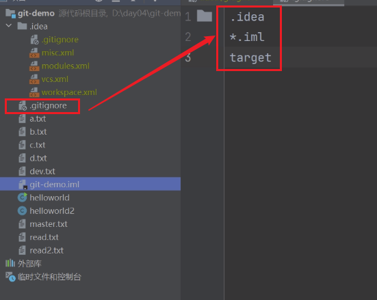

## 基础概念

1. GitHub

   > 1. 提供基于git的版本托管服务。所以说Git 只是 GitHub 上用来管理项目的一个工具而已
   > 2. 当你创建了一个Github仓库后，你就可以通过对它进行一些操作，如watch、star、fork，还可以 clone 或者下载下来

2. git

   > 是一款免费、开源的分布式版本控制系统,，你也可以理解成是一个工具（时光穿梭机）
   >
   > - **git只适合管理纯文本文件**
   >
   > - 文档管理可以考虑用svn
   > - 所有的版本控制系统，其实只能跟踪文本文件的改动，比如TXT文件，网页，所有的程序代码等等，Git也不例外。版本控制系统可以告诉你每次的改动，比如在第5行加了一个单词“Linux”，在第8行删了一个单词“Windows”。而图片、视频这些二进制文件，虽然也能由版本控制系统管理，但没法跟踪文件的变化，只能把二进制文件每次改动串起来，也就是只知道图片从100KB改成了120KB，但到底改了啥，版本控制系统不知道，也没法知道
   > - 不幸的是，Microsoft的Word格式是二进制格式，因此，版本控制系统是没法跟踪Word文件的改动的
   > - 使用Windows的童鞋要特别注意：千万不要使用Windows自带的**记事本**编辑任何文本文件。原因是Microsoft开发记事本的团队使用了一个非常弱智的行为来保存UTF-8编码的文件，他们自作聪明地在每个文件开头添加了0xefbbbf（十六进制）的字符，你会遇到很多不可思议的问题，比如，网页第一行可能会显示一个“?”，明明正确的程序一编译就报语法错误，等等，都是由记事本的弱智行为带来的。建议你下载[Visual Studio Code](https://code.visualstudio.com/)代替记事本，不但功能强大，而且免费！

3. Github的基本单词

   > - Repository：仓库的意思，即你的项目
   >
   > - Issue：你开源了一个项目，别人发现你的项目中有bug，或者哪些地方做的不够好，他就可以给你提个 Issue ，即问题
   >
   > - Fork：本质上是在原有项目的基础上新建了一个分支，
   >
   > - Pull Request：是基于 Fork 的，想把自己的改进合并到原有项目里，这个时候他就可以发起一个 Pull Request（简称PR） 
   >
   > - Watch：持续关注
   >
   > - Gist：只是单纯的想分享一些代码片段

## Git

### 概述

1. 版本控制是什么

   > - 版本控制是一种记录一个或若干文件内容变化，以便将来查阅特定版本修订情况的系统，对于软件开发领域来说版本控制是最重要的一环

## Git安装

### 验证安装 

## Git全局配置

### 身份标识

> - git config --global user.name "名字"
> - git config --global user.email "邮箱"

### 权限开通

## 本地基础操作

### 初始化 -- git init

> - 把目录变成Git可以管理的仓库，之后会多出来一个  .git 文件夹，此时Box1文件夹就是一个Git仓库了
>
> 
>
> - Git命令必须在Git仓库目录内执行（`git init`除外），在仓库目录外执行是没有意义的

### 添加到暂存区 -- git add

> - 在文件还没有提交到git仓库中时，我们可以随便编辑文件
>
> - 此时调用 git add +文件 **将内容从工作目录添加到暂存区（或称为索引（index）区），以备下次提交**
> - 再次使用git status 则显示文件等待被提交（Changes to be committed）
> - 可使用git rm --cached 移除缓存
> - 需要提交的文件修改通通放到暂存区，然后，一次性提交暂存区的所有修改

### 提交到本地仓库 -- git commit

> - `git commit` -m "whrite something"
>   - `-m`后面输入的是本次提交的说明，可以输入任意内容，当然最好是有意义的，这样你就能从历史记录里方便地找到改动记录。
>
> 
>
> - 将暂存区的内容提交到当前分支

### 在未提交前查看修改 -- git diff

> 

###　查看版本提交记录 -- git log

> 
>
> - 一大串类似`1094adb...`的是   **commit id（版本号）** ，和SVN不一样，Git的`commit id`不是1，2，3……递增的数字，而是一个SHA1计算出来的一个非常大的数字，用十六进制表示
>   - **为什么`commit id`需要用这么一大串数字表示呢？因为Git是分布式的版本控制系统，后面我们还要研究多人在同一个版本库里工作，如果大家都用1，2，3……作为版本号，那肯定就冲突了**

### **回退  --  git reset **

> - 将暂存区的文件取消暂存或切换版本
> - 
> - 切换版本
>   - 首先要知道当前是哪个版本 ——  用Head表示
>     - 上一个版本就是Head^
>     - 上上一个版本就是Head^^
>     - 往上100个版本Head~100
>   - 回退指令
>     - git reset --hard Head^：回退到上个版本已提交状态
>     - git reset --soft Head^：回退到上个版本的未提交状态
>     - git reset --mixed Head^：回退到上个版本的已添加但未提交状态
>   - 20返回19后怎么从19返回20？
>     - 在命令行窗口未关闭时，往上找到commit id，指定回到20版本
>       - git reset --hard 版本号
>         - **版本号没必要写全，前几位就可以了**
>         - 
>       - **若窗口关闭，git也总有后悔药可吃**
>         - git reflog：会记录你的每一次命令，可查看commit id
>

### 版本回退问题实例

> - 在依次更新并push后，我们有三个版本：版本1，版本2，版本3

> - 此时选择回退到版本1，若直接 git push origin master 会显示当前版本落后远程版本
> - 选用 git push --force origin master  **==强制提交执行回退==**

> - 此时使用git log 查看版本则只会显示版本1 与之前的版本，不会显示版本2和3
> - 使用  git reflog 查看最近的版本
> - 使用 **==git reset --hard==** +上版本哈的哈希码回退
>   - git reset --hard 16b0233
> - 然后在 --hard 提交

### 撤销修改

> - 将工作区的修改全部撤销  --  git checkout 
>   - 修改后还未放入暂存区：回到和版本库一模一样的状态
>   - 已添加到暂存区：回到添加到暂存区后的状态
>   - 总之，就是让这个文件回到最近一次`git commit` 或 `git add`时的状态。
> - 将暂存区的修改撤销  --  git reset HEAD <file>

### 删除文件 -- git rm

> - git rm test.txt

## 远程仓库操作

### 查看远程仓库  --  git remote

> - 查看当前项目有哪些远程仓库
>
>   - git remote -v 
>
>   

### 添加远程仓库  --  ==git remote  add+地址==

> - git remote add origin  仓库地址
>   - git remote add origin git@github.com:stormzhang/test.git
>     - 添加一个远程仓库
>     - 名字是： git@github.com:stormzhang/test.git
>     - orgin 是给远程仓库起的名字
> - **==起别名==**
>   - 仓库唯一时随便
>   - 不唯一时要区分

### 删除关联的远程仓库  -- git remote remove +远程仓库名

> - 若只有一个远程仓库
>   - git remote remove origin
> - 若有多个
>   - git remote remove 远程别名

### 拉取  --  clone

> - git clone git@github.com:syd3344/GitNote.git 
>   - 这便将github项目克隆到了本地
>   - 项目本身就是一个git仓库
>   - 在GitNote.git 下任意修改或者添加进行commit之后就可以Push

### 推送  --  Push

> - 推送到指定仓库  ——  git push <remote-name> (仓库名字)
>
>   - git push origin master - 推送本地分支master到远程仓库**origin**       
>
>   - git push origin feature-branch - 推送本地分支feature-branch到远程仓库origin 
>
>     
>
> - 推送指定分支到指定仓库   ——  git push origin <local-branch>:<remote-branch>
>
>   - 推送本地 master 分支内的 test.txt 文件 到远程仓库 Git Node 中 的main 分支  的示例代码
>   - git push origin master:main

### 更新  --  pull

> - git  pull  origin master

#### 本地与远程建立连接场景

> - 在本地创建仓库后想要与远程建立连接时，执行拉取操作会报错
> - Git 会拒绝操作，并给出错误提示，因为这些分支之间没有任何共享的祖先提交。
> - 因为在此时它们是两个不同的项目，要把两个不同的项目合并需要添加 **==--allow-unrelated-histories==**

##### **git pull拆解**

> - ==**git pull  是  git fetch  和  git merge 的组合操作**==
> - 也就是说，`git pull` 在执行时会先从远程仓库获取最新的更改（`git fetch`），然后将这些更改合并到当前的本地分支（`git merge`）。
> - 而`--allow-unrelated-histories` 是 Git 中的一个选项，用在 **git merge** 命令中，用于允许合并没有共同历史的两个分支。

## ==错误场景==

### 第一天

> - 第一天，本地创建仓库，写代码，提交远程
>
>   - 场景
>
>     - 创建本地仓库后，要先建立连接再去写代码
>     - 如果 先写代码 在建立连接 在pull 就会报错
>
>     - 
>
>   - 解决办法
>
>     - 强制执行拉 git pull origin master  --allow-unrelate
>     - 
>     - 
>     - 同时按下 shift + :，输入q退出

### 第二天

> - 第二天，正常提交代码，和他人开发同一个项目，但不是同一个文件
>   - **错误场景**
>     - 
>   - 解决办法
>     - **==每次提交之前要先拉==**

### 第三天

> - 第三天，和同事开发同一个文件
>   - 错误场景
>     - A刚拉完，B提交了
>       - 
>       - 因为处理的是同一个文件，此时按照信息pull时会产生冲突问题，不知道先后顺序
>         - 
>       - 文件变成交叉样式
>         - 
>   - 解决办法
>     - **手动解决排序冲突**
>     - **标记文件为已解决**
>       - git add hahah.txt
>     - **继续 Rebase**
>       - **==git rebase==** --continue
>     - **git rebase --continue 可以替换为 git -commit 吗？**
>       - 不可以。
>       - `git rebase --continue` 和 `git commit` 是不同的命令，适用于不同的场景：
>         - **git rebase --continue**：**==这个命令用于继续一个正在进行的 rebase 操作，尤其是在解决冲突之后。它会将解决后的更改应用到当前的提交历史上。==**
>         - **git commit**：这个命令用于创建一个**==新的提交==**，适用于任何时候你需要提交当前的更改，但在 rebase 过程中，你应该使用 `git rebase --continue`。
>       - 如果你正在进行 rebase 操作并解决了冲突，必须使用 `git rebase --continue` 来继续操作。
>     - **`rebase` 概述**
>       - rebase  操作是指在尝试将某个提交的更改应用到当前分支时，Git 遇到了冲突。
>       - 具体来说，这个过程涉及以下几个步骤：
>         - **更新历史**：你可能在某个特性分支上执行 `git rebase`，想将这个分支的更改应用到最新的基础上（通常是主分支）。
>         - **遇到冲突**：在自动应用提交时，Git 发现某些文件（如 `exception/hahah.txt`）中存在内容冲突，这使得无法直接合并这些更改。
>         - **解决冲突**：Git 暂停了 rebase 操作，提示你手动解决冲突，标记解决后的文件，然后继续 rebase。
>       - **在这种情况下，`rebase` 旨在让你的特性分支与主分支的最新状态保持一致，但由于冲突的存在，导致操作未能成功完成。你需要解决冲突，标记文件为已解决，然后运行 `git rebase --continue` 来继续操作。**

## ==**分支**==

> - **==分支  --  备份==**
>   - 保证主体的安全性
>     - 分支挂了不影响主干
>   - 环境区分，开发各自的代码，相互独立，互不影响
>   - 本地和远程都可以创建分支

### 查看分支

> - git branch      --  查看所有本地分支
>- 
> - git branch  -r  --  查看所有远程分支
>- git branch  -a  --  列出所有本地和远程分支
> 

### 创建分支

> - git branch name
> - 在master分支下
> - 

### 切换分支

> - 切换已有分支
>   - git checkout a
>
> 
>
> - 创建并切换到该分支
>   - git checkout -b b
>
> 

### 合并分支 -- git merge a

> - 两种方式
>   - 方式一：先在本地合并
>     - 先切到master分支
>     - git merge a
>   - 方式二：先传到远程，在远程合并
>     - 一般不允许在远程服务器合并

### 删除分支

> - 删除a分支
>  - git branch -d a
> - 强制删除 
>   - git branch -D a

### 打标签  --  git tag 

> 

## 工作区和暂存区

### 工作区

> -  就是你在电脑里能看到的目录

### 版本库

> - 工作区有一个隐藏目录`.git`，这个不算工作区，而是Git的版本库。
> - 版本库里存了很多东西，其中最重要的就是称为stage（或者叫index）的暂存区
> - 还有Git为我们自动创建的第一个分支`master`，以及指向`master`的一个指针叫`HEAD`

### 暂存区

> - 

## Git优秀的原因

> - Git跟踪并管理的是修改，而非文件

## SSH

### 概述

> - SSH是一种网络协议，用于计算机之间的加密登录。
> - 大多数 Git 服务器都会选择使用 SSH 公钥来进行授权，
>   所以想要在 GitHub 提交代码的第一步就是要先添加 SSH key 配置

### 生成密钥

> - ssh-keygen -t rsa : 指定rsa算法生成密钥 
> - 连接三个回车，生成两个文件
>   - **id_rsa**：这是私钥文件。
>   - **id_rsa.pub**：这是公钥文件。
> - 文件默认存储地址：C:\Users\SYD\.ssh

### 查看密钥

> - $ cat ~/.ssh/id_rsa.pub

### 配置Github

> - 配置
>
> 
>
> - 测试
>
>   
>
> 

### 配置Gitee

## 在IDEA中使用Git

### 启用Git

### 过滤/忽略

