## 基础概念

1. GitHub

   > 1. 提供基于git的版本托管服务。所以说Git 只是 GitHub 上用来管理项目的一个工具而已
   > 2. 当你创建了一个Github仓库后，你就可以通过对它进行一些操作，如watch、star、fork，还可以 clone 或者下载下来

2. git

   > 是一款免费、开源的分布式版本控制系统,，你也可以理解成是一个工具（时光穿梭机）
   >
   > - git只适合管理纯文本文件
   >
   > - 文档管理可以考虑用svn
   > - 所有的版本控制系统，其实只能跟踪文本文件的改动，比如TXT文件，网页，所有的程序代码等等，Git也不例外。版本控制系统可以告诉你每次的改动，比如在第5行加了一个单词“Linux”，在第8行删了一个单词“Windows”。而图片、视频这些二进制文件，虽然也能由版本控制系统管理，但没法跟踪文件的变化，只能把二进制文件每次改动串起来，也就是只知道图片从100KB改成了120KB，但到底改了啥，版本控制系统不知道，也没法知道
   > - 不幸的是，Microsoft的Word格式是二进制格式，因此，版本控制系统是没法跟踪Word文件的改动的
   > - 使用Windows的童鞋要特别注意：千万不要使用Windows自带的**记事本**编辑任何文本文件。原因是Microsoft开发记事本的团队使用了一个非常弱智的行为来保存UTF-8编码的文件，他们自作聪明地在每个文件开头添加了0xefbbbf（十六进制）的字符，你会遇到很多不可思议的问题，比如，网页第一行可能会显示一个“?”，明明正确的程序一编译就报语法错误，等等，都是由记事本的弱智行为带来的。建议你下载[Visual Studio Code](https://code.visualstudio.com/)代替记事本，不但功能强大，而且免费！

3. Github的基本单词

   > - Repository：仓库的意思，即你的项目
   >
   > - Issue：你开源了一个项目，别人发现你的项目中有bug，或者哪些地方做的不够好，他就可以给你提个 Issue ，即问题
   >
   > - Fork：本质上是在原有项目的基础上新建了一个分支，
   >
   > - Pull Request：是基于 Fork 的，想把自己的改进合并到原有项目里，这个时候他就可以发起一个 Pull Request（简称PR） 
   >
   > - Watch：持续关注
   >
   > - Gist：只是单纯的想分享一些代码片段

## Git

### 作用概述

1. 版本控制是什么

   > - 版本控制是一种记录一个或若干文件内容变化，以便将来查阅特定版本修订情况的系统，对于软件开发领域来说版本控制是最重要的一环

### 基础命令

2. 验证安装 — git

   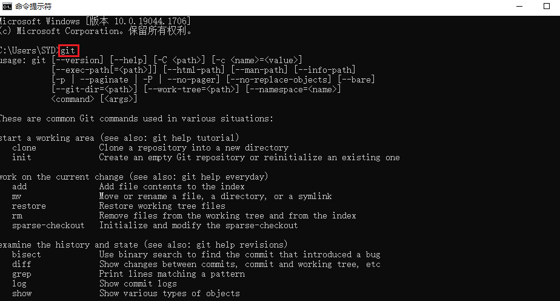

3. 初始化git仓库（git init） 

   > 把目录变成Git可以管理的仓库，之后会多出来一个  .git 文件夹，此时Box1文件夹就是一个Git仓库了
   >
   > 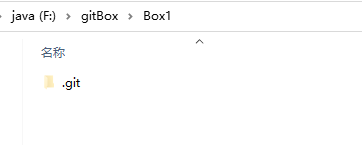
   >
   > - Git命令必须在Git仓库目录内执行（`git init`除外），在仓库目录外执行是没有意义的

4. 添加到暂存区（git add）

   > - 在文件还没有提交到git仓库中时，我们可以随便编辑文件
   >
   > - 此时调用 git add +文件 **将内容从工作目录添加到暂存区（或称为索引（index）区），以备下次提交**
   > - 再次使用git status 则显示文件等待被提交（Changes to be committed）
   > - 可使用git rm --cached 移除缓存
   > - 需要提交的文件修改通通放到暂存区，然后，一次性提交暂存区的所有修改

5. 提交（git commit）

   > - `git commit` -m "whrite something"
   >   - `-m`后面输入的是本次提交的说明，可以输入任意内容，当然最好是有意义的，这样你就能从历史记录里方便地找到改动记录。
   >
   > 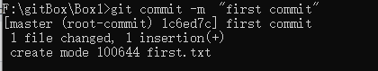
   >
   > - 将暂存区的内容提交到当前分支

6. 在未提交前查看修改（git diff）

   > 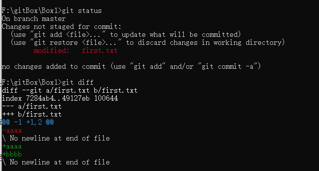

7. 查看版本提交记录（git log）

   > 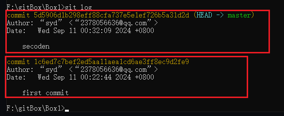
   >
   > - 一大串类似`1094adb...`的是`commit id`（版本号），和SVN不一样，Git的`commit id`不是1，2，3……递增的数字，而是一个SHA1计算出来的一个非常大的数字，用十六进制表示
   > - 为什么`commit id`需要用这么一大串数字表示呢？因为Git是分布式的版本控制系统，后面我们还要研究多人在同一个版本库里工作，如果大家都用1，2，3……作为版本号，那肯定就冲突了

8. 回退（git ）

   > - 首先要知道当前是哪个版本 ——  用Head表示
   >   - 上一个版本就是Head^
   >   - 上上一个版本就是Head^^
   >   - 往上100个版本Head~100
   > - 回退指令
   >   - git reset --hard Head^：回退到上个版本已提交状态
   >   - git reset --soft Head^：回退到上个版本的未提交状态
   >   - git reset --mixed Head^：回退到上个版本的已添加但未提交状态
   > - 20返回19后怎么从19返回20？
   >   - 在命令行窗口未关闭时，往上找到commit id，指定回到20版本
   >     - git reset --hard 版本号
   >     - 版本号没必要写全，前几位就可以了
   > - 在git总有后悔药可吃
   >   - git reflog：会记录你的每一次命令，可查看commit id

9. 撤销修改

   > - 将工作区的修改全部撤销（git checkout -- readme.txt）
   >   - 修改后还未放入暂存区：回到和版本库一模一样的状态
   >   - 已添加到暂存区：回到添加到暂存区后的状态
   >   - 总之，就是让这个文件回到最近一次`git commit` 或 `git add`时的状态。
   > - 将暂存区的修改撤销（git reset HEAD <file>）

10. 删除文件（git rm）

    > git rm test.txt

11. 查看/创建分支（git branch）

    > - 产看当前分支
    >
    > 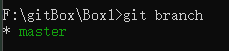
    >
    > 
    >
    > - 创建分支
    >
    > 

12. 切换分支( git checkout a )

    > - 切换已有分支
    >
    > 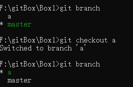
    >
    > - 创建并切换到该分支
    >
    > 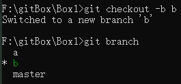

13. 合并分支( git merge a )

    > 流程
    >
    > - 切换到master
    > - 合并分支

14. 删除分支 ( git branch -b  )

    > 删除a分支
    >
    > - git branch -d a
    > - 强制删除 : git branch -D a

15. 打标签( git tag )

    > 

### 工作区和暂存区

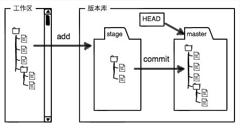

1. 工作区

   > -  就是你在电脑里能看到的目录

2. 版本库

   > - 工作区有一个隐藏目录`.git`，这个不算工作区，而是Git的版本库。
   > - 版本库里存了很多东西，其中最重要的就是称为stage（或者叫index）的暂存区
   > - 还有Git为我们自动创建的第一个分支`master`，以及指向`master`的一个指针叫`HEAD`

3. 暂存区

   > - 

### Git优秀的原因

> - Git跟踪并管理的是修改，而非文件

### SSH + 添加远程仓库

1. 概述

   > - SSH是一种网络协议，用于计算机之间的加密登录。
   > - 大多数 Git 服务器都会选择使用 SSH 公钥来进行授权，
   >   所以想要在 GitHub 提交代码的第一步就是要先添加 SSH key 配置

2. 添加SSH配置

   > 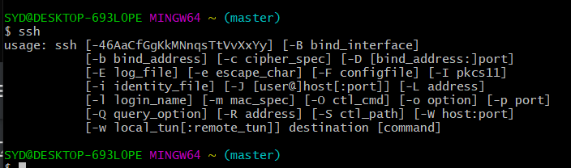
   >
   > - 生成密钥
   >   - ssh-keygen -t rsa : 指定rsa算法生成密钥 
   >   - 连接三个回车，生成两个文件
   >     - **id_rsa**：这是私钥文件。
   >     - **id_rsa.pub**：这是公钥文件。
   >   - 文件默认存储地址：C:\Users\SYD\.ssh
   >   
   >   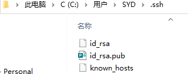
   >   
   > - 配置Github
   >
   >   - 配置
   >     - 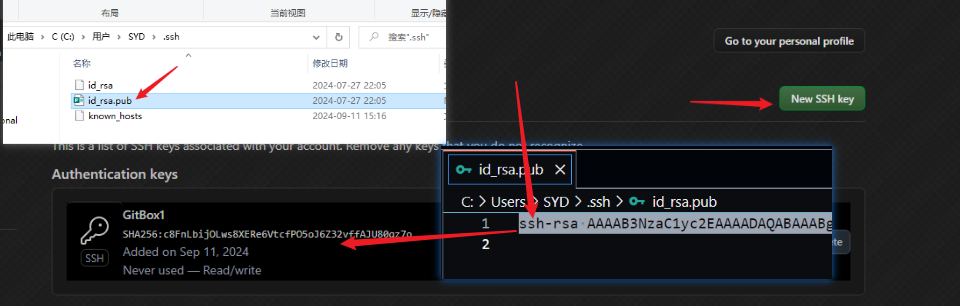
   >   - 测试
   >     - 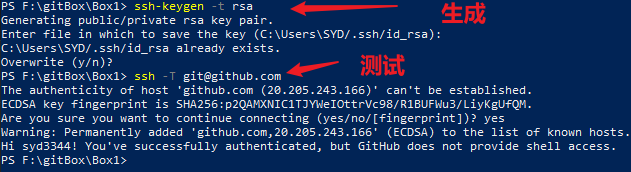
   >   - 

###  推送与拉取

1. 拉取( clone )

   > - git clone git@github.com:syd3344/GitNote.git 
   >   - 这便将github项目克隆到了本地
   >   - 项目本身就是一个git仓库
   >   - 在GitNote.git 下任意修改或者添加进行commit之后就可以Push

2. 推送( Push )

   > - 拉去下来的仓库
   >   - 推送到指定仓库  ——  git push <remote-name> <branch-name>
   >     - git push origin master - 推送本地分支master到远程仓库origin       
   >     - git push origin feature-branch - 推送本地分支feature-branch到远程仓库origin 
   >   - 推送到指定仓库的指定分支   ——  git push origin <local-branch>:<remote-branch>
   >     - 推送本地 master 分支内的 test.txt 文件 到远程仓库 Git Node 中 的main 分支  的示例代码
   >     - git push origin master:main
   >     - 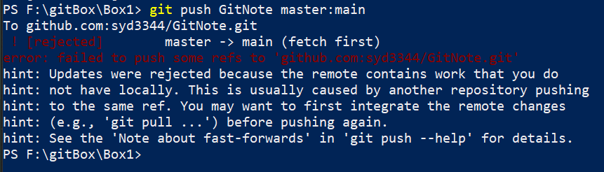
   >     - 这个错误是由于远程仓库的 `main` 分支包含一些你本地没有的更改，因此 Git 拒绝了你的推送。为了避免覆盖远程分支的已有更改，Git 需要你先拉取远程分支上的更改，并合并到本地的 `master` 分支中，然后再推送。
   > - 本地仓库推送
   >   - 将本地项目与Github关联
   >     - git remote add origin git@github.com:stormzhang/test.git
   >     - 添加一个远程仓库
   >     - 名字是： git@github.com:stormzhang/test.git
   >     - orgin 是给远程仓库起的名字
   >       - 仓库唯一时随便
   >       - 不唯一时要区分
   >   - 查看当前项目有哪些远程仓库
   >     - git remote -v 
   >     - 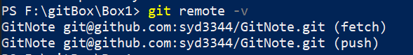

3. 更新（pull）

