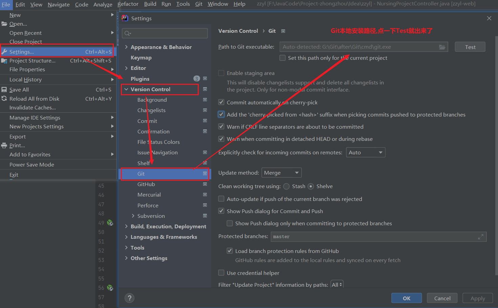
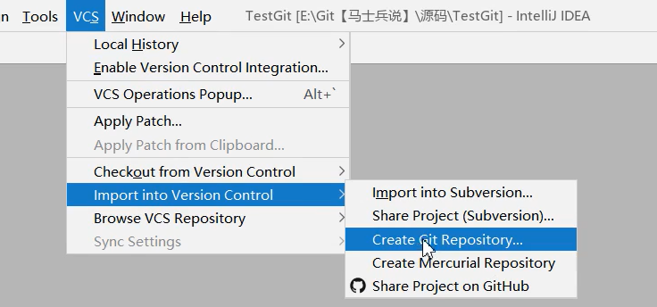
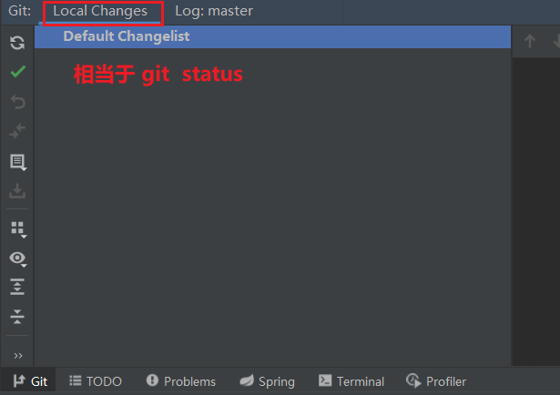

## 方式一：先创项目

### 启用Git

### 初始化本地仓库   --  git init

### 添加到暂存区  --  Git   add（使用命令行更简单）

#### 内嵌命令行

#### 查看本地变化

### 添加到本地库  --  Git  commit（使用命令行更简单）

### 添加远程仓库  --  git remote add origin  远程地址

### 本地与远程建立连接   ==**先拉后提交**==

#### ==**拉**==：git pull origin master  --allow unrelated-histories

> - 需要添加 --allow unrelated-histories
>   - 告诉Git  **==允许不相关历史合并==**

#### ==**提交**==：git push -u origin master -f

> - 

## 方式二：先克隆

### 从远程拉仓库  --  git clone

### 创建工程项目  

### 将工程项目拖进Git仓库

> - 无痛且快速

## 过滤 -- .ignore

